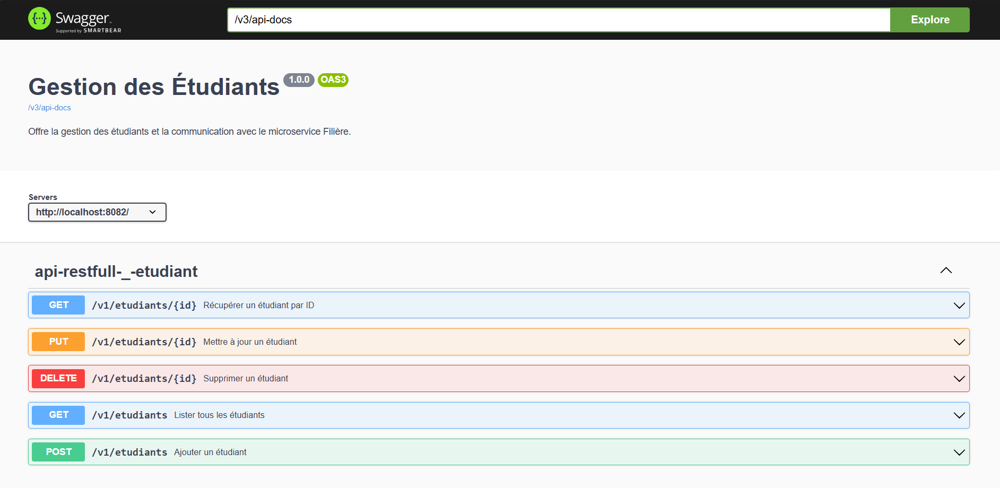
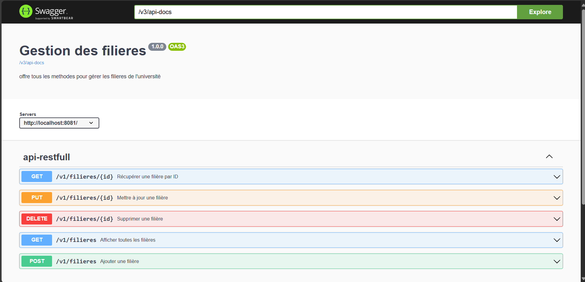

🎓 Projet Microservices : Gestion Faculté (Étudiants & Filières)

Ce projet illustre une architecture microservices Spring Boot pour la gestion des étudiants et des filières au sein d’une faculté.
L’objectif est de démontrer la communication interservices via REST API et Feign Client, avec documentation générée par Swagger OpenAPI.

Remarque : Si la filière existe, on sauvegarde l'étudiant, sinon On le sauvegarde pas !!!

==========================================================================================
⚙️ Technologies utilisées

Outil / Framework	Utilisation

Spring Boot 3.x	Base des microservices.

Spring Web	Création des API REST.

Spring Data JPA	Accès à la base de données.

Feign Client (Spring Cloud OpenFeign)	Communication interservices.

Swagger / Springdoc OpenAPI	Documentation interactive.

H2 / MySQL	Base de données.

Maven	Gestion des dépendances.

Lombok.

Postman pour les tests d’API.

==========================================================================================
Screenshots:
**Gestion Etudiants:**

Gestion Filieres:

