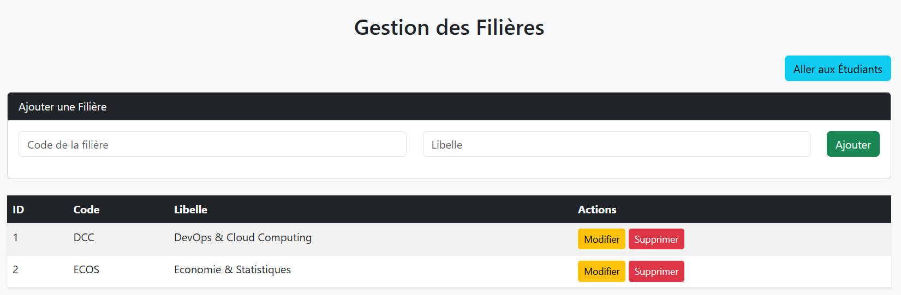
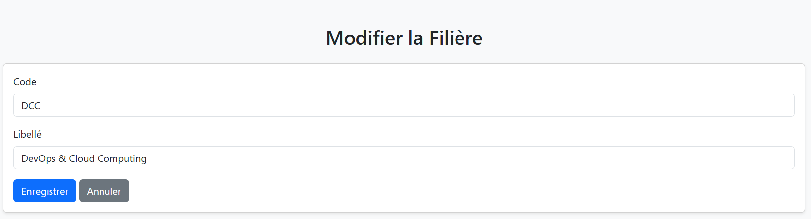
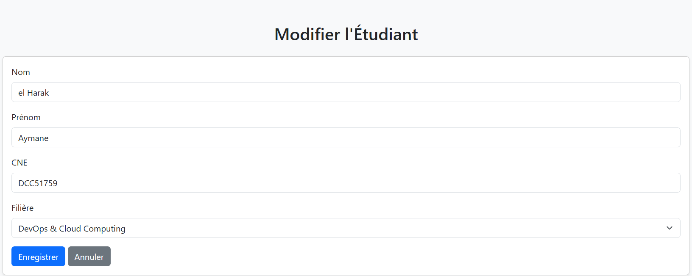

🎓 Projet Microservices : Gestion Faculté (Étudiants & Filières)

Description du projet

Ce projet est une application web basée sur Spring Boot et Thymeleaf, composée de deux microservices :

Gestion Filière (gestion_filiere) :

 >Permet de gérer les filières d’une université (CRUD : création, lecture, modification, suppression).

 >Fournit un service REST pour récupérer les informations sur les filières.

Gestion Étudiant (gestion_etudiant) :

 >Permet de gérer les étudiants (CRUD).

 >Les étudiants sont liés aux filières via un identifiant de filière.

 >Utilise un FeignClient pour récupérer les informations des filières depuis le microservice gestion_filiere.

Documentation API (Swagger)

Ce projet utilise Swagger pour documenter et tester les APIs REST. Swagger fournit une interface graphique qui permet de visualiser tous les endpoints, les paramètres attendus, et de tester les requêtes directement depuis le navigateur.

Remarque : Si la filière existe, on sauvegarde l'étudiant, sinon On le sauvegarde pas !!!

==================================================================
⚙️ Technologies utilisées

Outil / Framework	Utilisation

Spring Boot 3.x	Base des microservices.

Spring Web	Création des API REST.

Spring Data JPA	Accès à la base de données.

Thymeleaf pour le rendu des pages HTML

Bootstrap 5 pour le style

Feign Client (Spring Cloud OpenFeign)	Communication interservices.

Swagger / Springdoc OpenAPI	Documentation interactive.

MySQL	Base de données.

Maven	Gestion des dépendances.

Lombok.

Postman pour les tests d’API.

==================================================================
Screenshots:
**Gestion Filieres Page**

Modifier Filiere Page :

Gestion Filieres Swagger:

=========================
**Gestion Etudiants Page**

Modifier Etudiants Page :

Gestion Etudiants Swagger:

